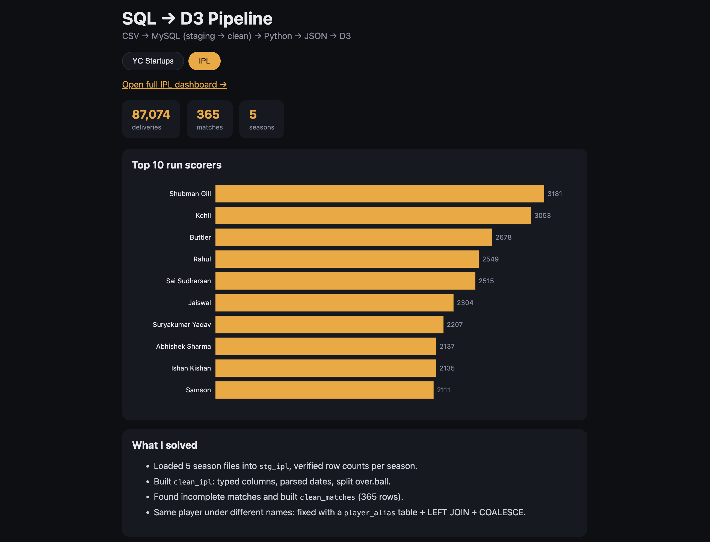
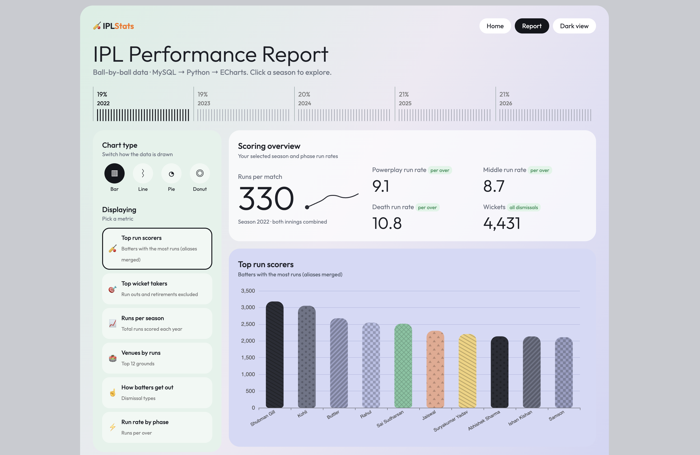
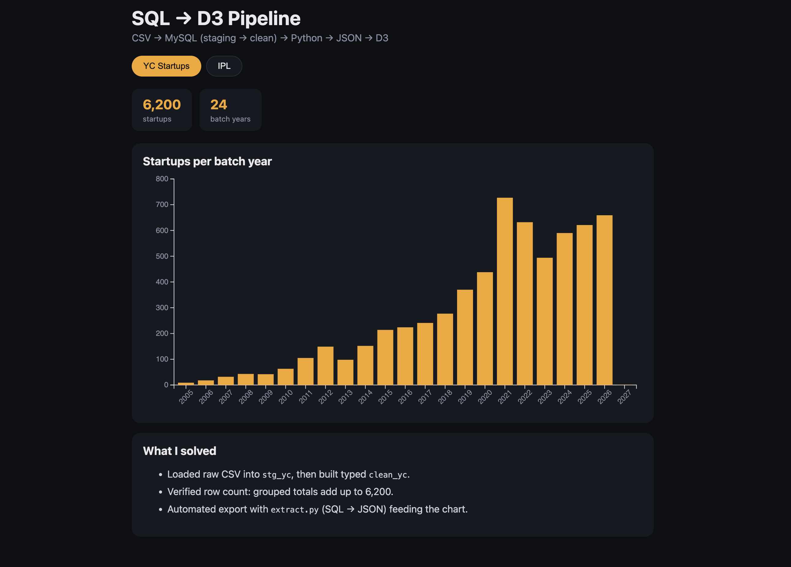

# sql-to-d3

Learning SQL and data viz by building a CSV → MySQL → Python → D3 pipeline.

## Projects
**1. Y Combinator startups** – 6,200 rows, startups per batch year.
**2. IPL** – 87,074 deliveries, 365 matches, top run scorers.

## What I solved
- Staging → clean table pattern (`stg_*` → `clean_*`) with typed columns
- Verified row counts after every load
- IPL: incomplete matches found and handled
- IPL: inconsistent player names fixed with `player_alias` + LEFT JOIN + COALESCE
- Python script runs any `.sql` file and writes JSON for D3

## Run
    python3 python/run_query.py sql/ipl/top_run_scorers.sql viz/data/top_run_scorers.json
    cd viz && python3 -m http.server 8000

## IPL dashboard (11 charts, ECharts + Tailwind)
Batting: top scorers, radar comparison, sixes vs fours, strike-rate bubbles.
Bowling: top wicket takers, dismissal rose chart.
Game flow: runs per season, phase run rate, over-by-over heatmap.
Teams: team runs stacked area, venue treemap.

## Screenshots

## What I learned
- Staging vs clean tables, and verifying counts after every load
- Fixing messy real data (player aliases) with LEFT JOIN + COALESCE
- Exporting SQL results to JSON with Python for browser charts
